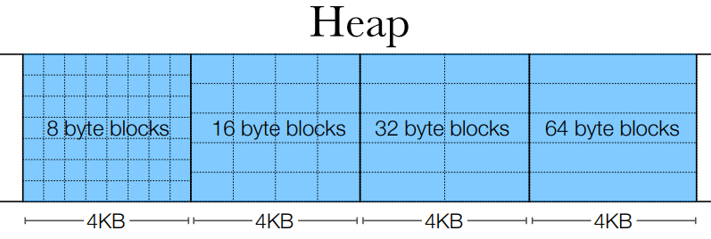

# Custom Segregated Heap Allocator Implementation

Welcome to the Custom Segregated Heap Allocator project! In this endeavor, the primary objective is to craft a personalized segregated heap allocator that offers efficient memory allocation and deallocation strategies.

## Project Overview

The essence of this project revolves around the creation of three crucial functions: `allocate_slab`, `my_alloc`, and `my_free`. These functions collectively define the core of memory management. Through careful design and understanding of memory organization, the allocator aims to provide optimized memory allocation for various use cases.

## Key Features

- **Memory Management:** The allocator ensures efficient usage of memory by segregating blocks into different bins based on their sizes.

- **Dynamic Allocation:** The `my_alloc` function efficiently assigns blocks from the appropriate bin, allowing dynamic memory allocation based on the requested size.

- **Deallocation:** The `my_free` function effectively releases allocated memory blocks, making them available for reuse.

- **Custom Allocator:** Unlike standard memory allocation methods, this project entails building a custom allocator tailored to specific memory allocation requirements.

## Getting Started

To explore and test this allocator, follow these steps:

1. Compile the project using `make`.

2. Utilize the provided Python tester or individual tests to evaluate the allocator's performance and functionality.

3. Experiment with different memory allocation scenarios to understand how the allocator handles various use cases.

## Contributions and Improvements

Feel free to contribute to the project by enhancing memory management strategies, optimizing the allocator's performance, or exploring innovative memory allocation techniques.

## Acknowledgments

This project is a result of a deep dive into memory management and allocation techniques, showcasing the intricacies of memory organization and efficient memory use.

Start exploring the world of custom memory allocation with this project today! Your engagement and contributions are highly encouraged and appreciated.
